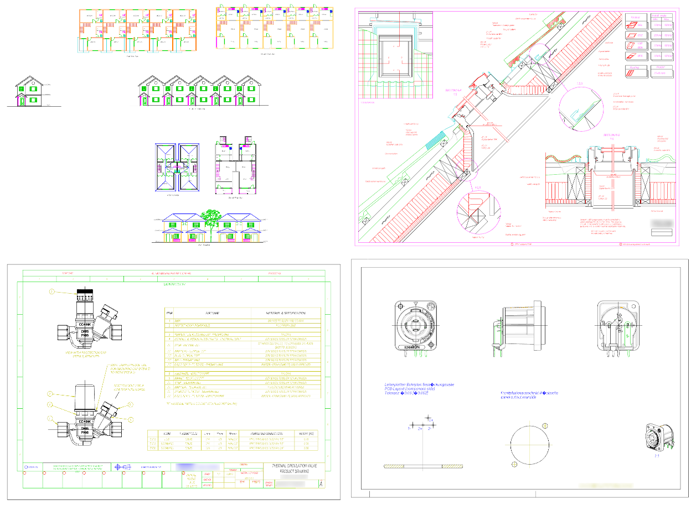

High-performant DXF files viewer which works just in your browser. It is written in 
JavaScript and uses WebGL for rendering. More details in the repository.



Play with it [here](https://vagran.github.io/dxf-viewer-example/).

<!--more-->

