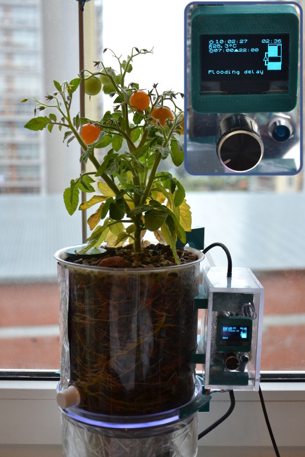

This funny project was started both for having fun with some "biotech" and with relatively new for 
those times C++11 standard, especially regarding its usage possibility in MCUs. This ended with 
fully automated home hydroponics system.  There is [an article](https://habr.com/ru/post/385135/) 
(in Russian) about this project.

I have a dream about version 2. This time it should have a bit larger scale and more serious 
approach to "biotech" part (tomatoes from version 1 had terrible taste). But still no time to
implement all new ideas.



<!--more-->

